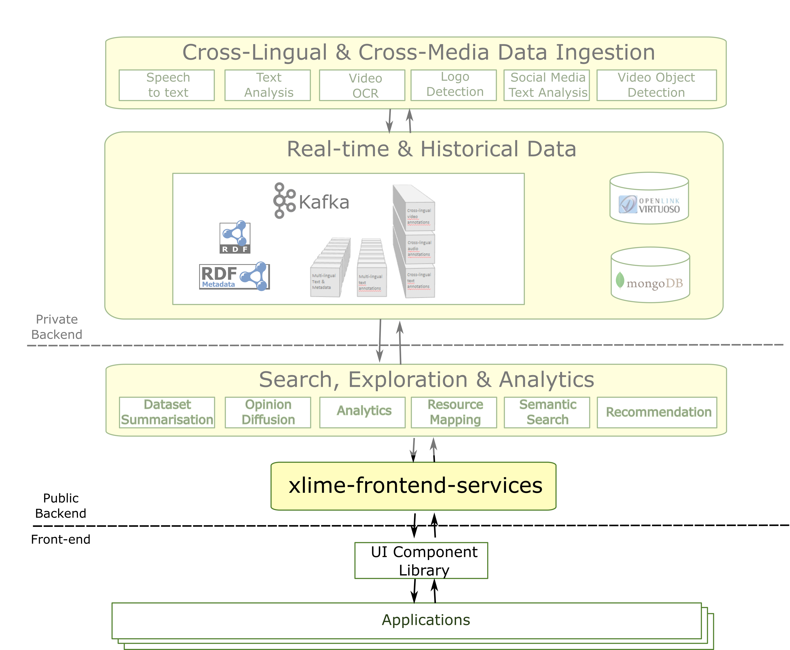

Web-service layer for the [xLiMe project](http://xlime.eu) that facilitates building user interfaces.

# Motivation and Design considerations

The xLiMe project has has produced many back-end services, many of which expose low-level APIs intended for integration within other 
components within the project. Using those services often requires knowledge about the xLiMe datamodel and architecture, as well
as access to private components like the message bus and databases used internally. This makes it hard to build applications and 
user interfaces. This web-application aims to define and provide a set of services which make it easier to build user interfaces.

The main design considerations are:
 * define REST services at a level of abstraction that is amenable for end-user intefaces: orchestrate several low-level services in order to
 compose and return meaningful data that can be shown and inspected by end-users.     
 * provide JSON objects for the main data that can be found in xLiMe and that balance the amount of information that can be 
 queried in 'real-time' and presented to users. I.e. not only provide URIs for the data, but provide enough information that end-users 
 can make sense of the information and explore the xLiMe dataset and the platform's capabilities.

# Services

## `mediaItem`

 Returns UI friendly representations of xLiMe media-items (i.e. news articles, tv programmes or social-media posts), based on their URI.
 This service returns the main information of the media-items (e.g. title, publisher, description), but not any additional annotations 
 extracted by the xLiMe platform. See also service `annotationsFor. 

 * input parameters:
 ** **url**: one or more URLs of xLiMe media-items. E.g. `http://ijs.si/article/367691329`, `http://zattoo.com/program/111851734` or `http://vico-research.com/social/056eeb12-6a21-38af-b40c-94fbabe8628f`
 * output: json object describing the requested media-items (and/or a list of errors when trying to retrieve the media items).
 
## `latestMediaItems`

 Returns UI friendly representations of xLiMe media-items that have been recently published.
 
 * input parameters:
 ** **minutes**: integer value indicating the number of minutes before the current time to look for media items. Default value is `5`. 
 * output: json object with a list of "recent" media items as indicated by the `minutes` input parameter. This service may impose a limit on the number of media-items returned. Also, if the window of time is very large, it may return media-items within the window, but which are not "recent" anymore. 
 
## `entities`

 Returns UI friendly representations of entities defined in some Knowledge Base (typically DBpedia or Wikidata) used by the xLiMe platform to annotate media-items.
 
 * input parameters:
 ** **url**: one or more URLs of KB entities for which you want to receive a UI friendly representation.
 * output: json object describing the requested KB entities when supported by the xLiMe platform.
  
## `annotationsFor`
 
 Returns UI friendly representations of annotations for a given xLiMe media-item.
 
 * input parameters:
 ** **url**: one or more URLs of xLiMe media-items for which you want to get annotations.
 * output: json object describing the xLiMe annotations of the media-items.
 
## `dataset-summary`

 Returns a UI friendly representation of a dataset(s) used by this web application. 
 
 This service helps to put the responses to the other web-services into context. Also, this helps to check what are the boundaries and properties of the data being used. Example information included in the response include: number of news articles, number of microposts, etc. 
 
 * input parameters:
 ** **ds**: either `mongo` or `sparql`
 * output: json object summarising the xLiMe dataset
 
## `spheres`

 Returns a set of recommendations given a context of xLiMe resources.
 
 * input parameters:
 ** **context**: one or more URLs of xLiMe resources for which you want to get annotations.
 * output: json object describing the recommendation spheres. Each recommendation contains an xLiMe resource (media item, KB entity, etc.)

# Running

A development version of these services is available [here](http://expertsystemlab.com/frontend-services). For example:
  
  [latestMediaItems](http://expertsystemlab.com/frontend-services/latestMediaItems)
  
Until we provide releases, you can run a local instance of this project by executing

  mvn jetty:run

##Notes
Currently this project requires:
* Access to credentials to non-public back-end xLiMe services such as the `xLiMe` Sparql endpoint. You need to provide a configuration file
	`xlime-ui-services.properties` which configures how to access those protected services. Contact one of the developers to request 
	these information.
* From version 0.0.6 you will also need to provide a MongoDB instance loaded with xLiMe data as this speeds up many of the operations (instead 
	of relying on the xLiMe sparql endpoint). In the future, we may publish mongoDB data dumps to facilitate this process.  
 

Licensed under the Apache Software License, Version 2.0

